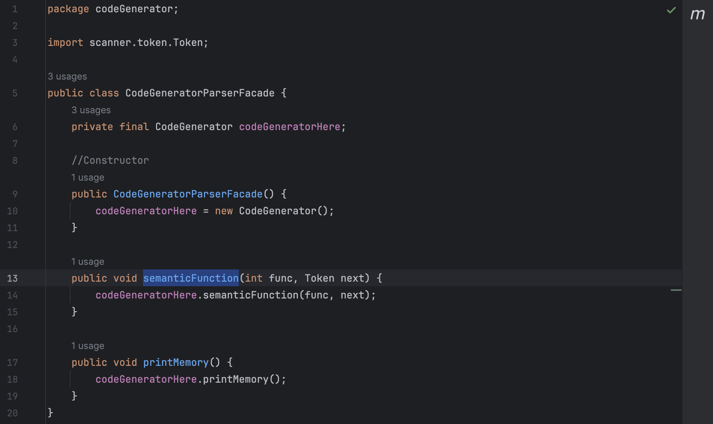
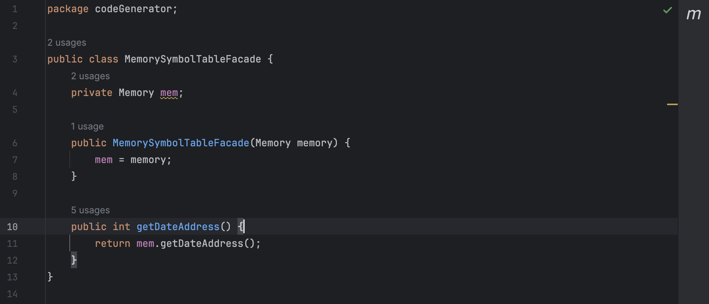

# Experiment8

## 2 Facades:

### CodeGenerator Facade

The Class CodeGenerator has been used in Parser.java. But Parser only used 2 functions of this big class. So we've created a facade for this parser.

This Facade contains only printMemory and semanticFunction methods.

### Memory Facade

The class Memory has too many methods. But in class SymbolTable, the only method that has been used is memory.getDateAddress(). So we will create a facade for class SymbolTable using this method.

This Facade contains only getDateAddress methods.

