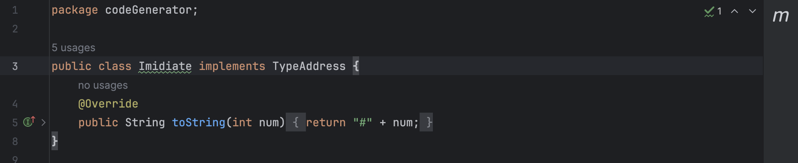
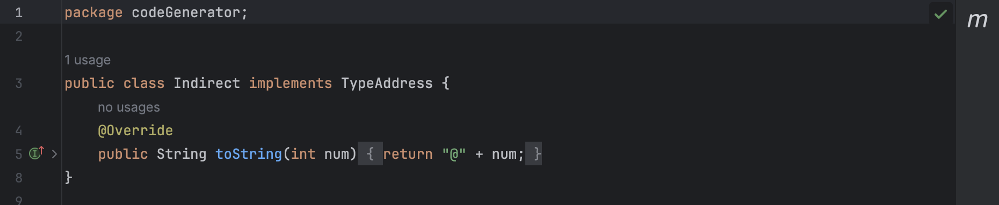
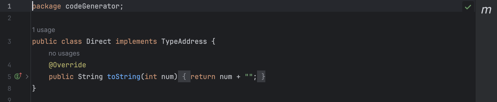
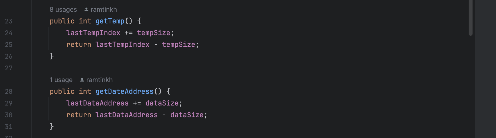
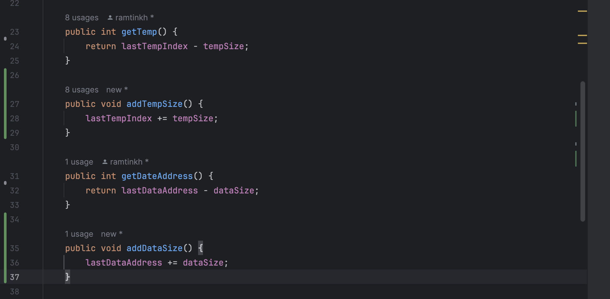

# Experiment8

## 2 Facades:

### CodeGenerator Facade

The Class CodeGenerator has been used in Parser.java. But Parser only used 2 functions of this big class. So we've created a facade for this parser.

This Facade contains only printMemory and semanticFunction methods.

### Memory Facade

The class Memory has too many methods. But in class SymbolTable, the only method that has been used is memory.getDateAddress(). So we will create a facade for class SymbolTable using this method.

This Facade contains only getDateAddress methods.

## Strategy

### Use this pattern in TypeAddress

Instead of using if/else in Address.java toString method, we consider TypeAddress as an Strategy to be set and return good toString output itself.

We should consider changing all enum uses in CodeGenerator and replace them with correct object.

## Seperate Query From Modifier

In Class Memory.java there are two methods that violate this pattern.

We Should Seperate modification of variables fromo getters in these two methods. In the picture below we fixed this issue.

