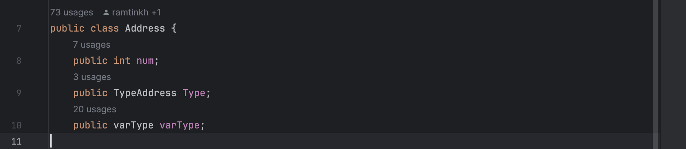
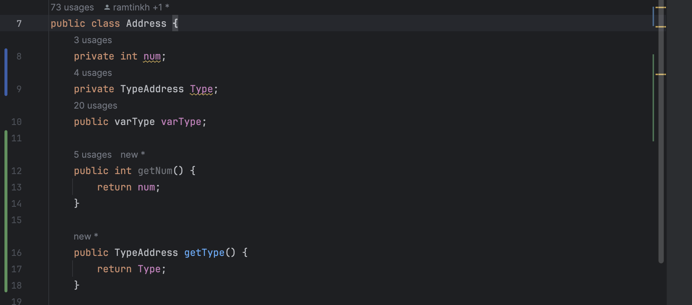
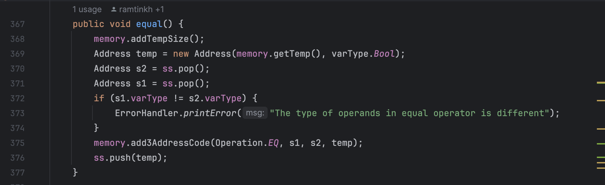
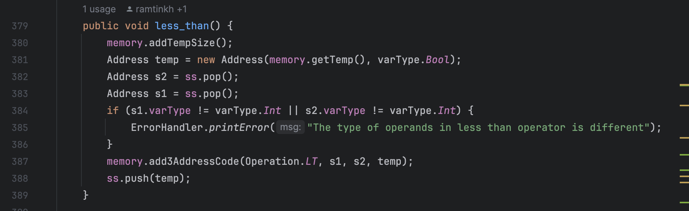
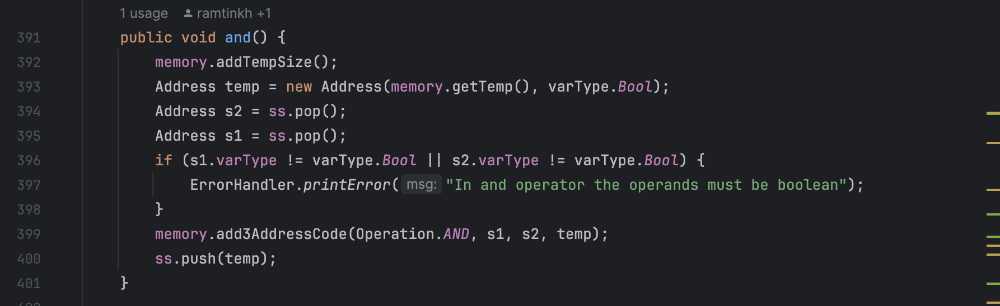
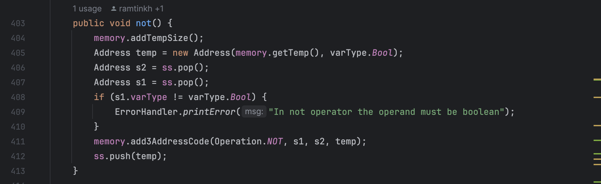
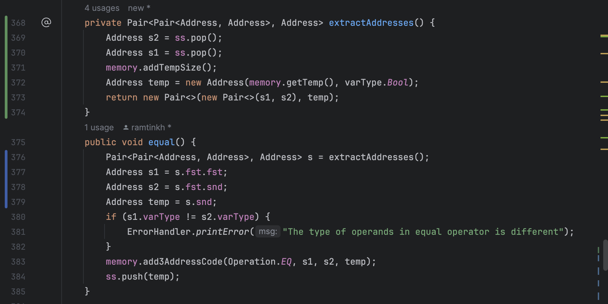
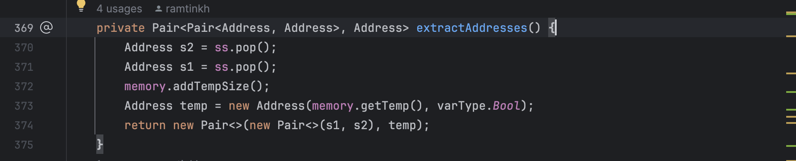
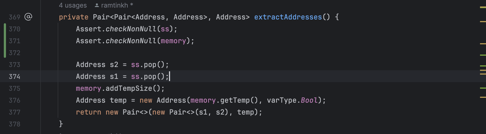

# Experiment8

## 2 Facades:

### CodeGenerator Facade

The Class CodeGenerator has been used in Parser.java. But Parser only used 2 functions of this big class. So we've created a facade for this parser.

This Facade contains only printMemory and semanticFunction methods.

### Memory Facade

The class Memory has too many methods. But in class SymbolTable, the only method that has been used is memory.getDateAddress(). So we will create a facade for class SymbolTable using this method.

This Facade contains only getDateAddress methods.

## Strategy

### Use this pattern in TypeAddress

Instead of using if/else in Address.java toString method, we consider TypeAddress as an Strategy to be set and return good toString output itself.

We should consider changing all enum uses in CodeGenerator and replace them with correct object.

## Seperate Query From Modifier

In Class Memory.java there are two methods that violate this pattern.

We Should Seperate modification of variables fromo getters in these two methods. In the picture below we fixed this issue.

## Self Encapsulated Field

In Class Address there are 3 public variables which been used from outside of the class directly.

We should make them private and Outsiders just call getters and setters. Because of the document for the experiment asks us to solve 1 of these bad smells, we don't make varType private. We just fix Type and num.

## Extract Methods

We have a same pattern in 4 different method like the pictures below. We can Extract a method named extractAddresses() from these methods to remove a bad smell.

After we Extract our method, The result will be like this.

## Introduce Assertion

In the previous method addition we did, There is a condition that ss and memory shouldn't be NULL. 

So using this type of Refactoring we create 2 lines of Assert conditions to make sure those variables are not NULL.

